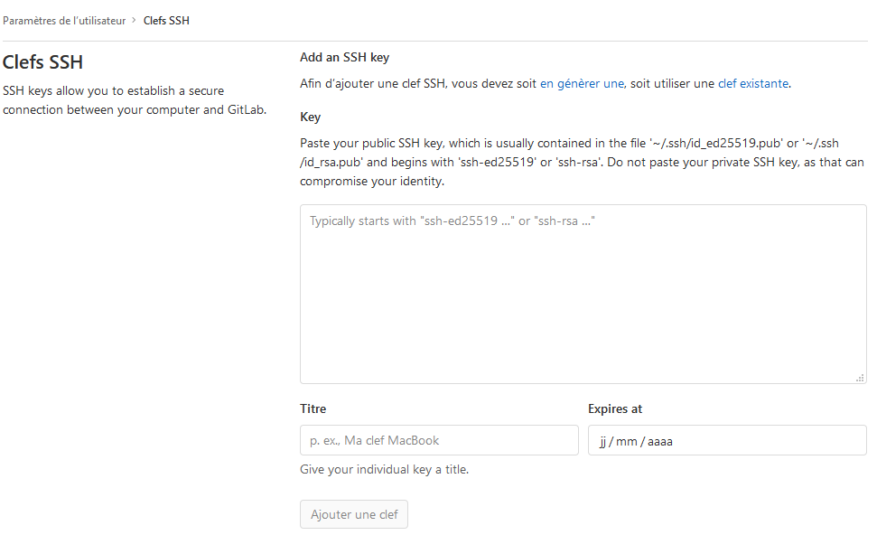
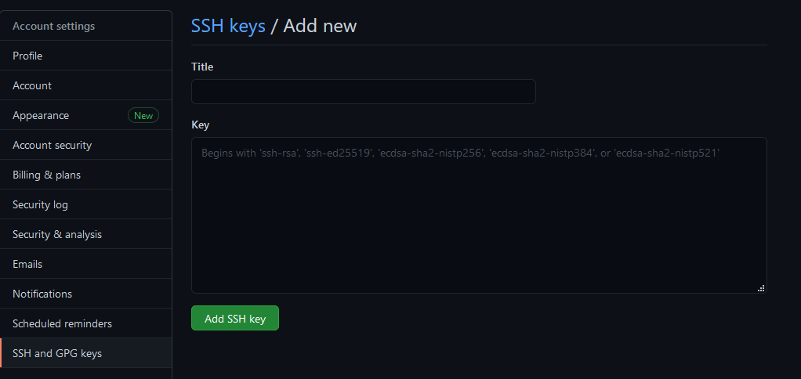

```{r setup, include=FALSE}
knitr::opts_chunk$set(echo = TRUE)
```

`r emo::ji("warning")` Site en construction `r emo::ji("warning")`


Avant de pouvoir créer un package en R, vous allez devoir configurer votre poste de travail pour installer et paramétrer les différents outils nécessaires à la création de packages.

## installer les packages nécessaires à l'atelier.

Nous aurons besoins des packages suivants pour cet atelier :

```{r, eval=FALSE}
install.packages(c('devtools','usethis','roxygen2','testthat', 'pkgdown'))
```

## Configuration du proxy

Etape à réaliser quand vous êtes derrière un proxy.

- Ouvrir Rstudio et naviguez dans Tools -> Global Options / Packages : cliquez sur **Use Internet Explorer library/proxy for HTTP**.

- Créer un fichier texte appelé ***.Renviron*** à mettre dans le répertoire de travail par défaut de Rstudio, avec les informations ci-dessous. Pour se faire vous pouvez utiliser la commande `usethis::edit_r_environ()` après avoir installé le package {`usethis`} via `install.packages("usethis")`


```{r, eval = FALSE}
options(internet.info = 0)

http_proxy=URL_DU_PROXY

https_proxy=URL_DU_PROXY

```

<aside>
Le fichier ***.Renviron*** est un fichier éditable qui permet de créer des variables d'environnement. Ces variables sont utiles par exemple pour définir comme ici un proxy, ou des clefs d'API. Chaque clefs définies dans le ***.Renviron** peuvent ensuite s'appeler en utilisant `Sys.getenv("NOM_DE_LA_CLEF")`. Ici par exemple `Sys.getenv("http_proxy")` renvoi l'url du proxy.
Le fichier ***.Renviron*** peut être défini au niveau du répertoire par défaut de travail ou pour un projet particulier. Dans ce cas, seul le .Renviron du projet s'applique.
</aside>

## Configuration de GIT


### Télécharger git

- [Télécharger](https://git-scm.com/downloads) et installer GIT.

### s'identifier

Pour cela, utiliser le terminal dans Rstudio et déclarez votre nom et email.

```
git config --global user.name "Jean Claude Dusse"
git config --global user.email jcdusse@pays_merveilleux.fr
```

### Déclarer le proxy dans GIT

Dans le terminal de Rstudio, taper les lignes de commande suivante

```   
git config --global http.proxy URL_DU_PROXY
git config --global https.proxy URL_DU_PROXY`
```

## Déclarer un outil de gestion de conflit

- [Télécharger](https://winmerge.org/?lang=fr) et installer Winmerge

Winmerge est un outil graphique utile pour gérer la résolution des conflits de fusion dans GIT.

```
git config --global merge.tool winmerge
git config --global mergetool.prompt false
git config --global mergetool.winmerge.trustExitCode true
git config --global mergetool.winmerge.cmd "\"C:\Program Files\WinMerge\WinMergeU.exe\" -e -u -dl \"Mine\" -wr -dr \"Theirs\" \"$LOCAL\" \"$REMOTE\" \"$MERGED\""
```

Pour éviter de taper sans cesse son mot de passe, on peut aussi demander à git de le mémoriser :

```
git config --global credential.helper store
```

Pour retrouver les options de git déclarées, vous pouvez taper `git config --list` dans le terminal.


## Créer un compte github et/ou gitlab

- Sur github, cliquer sur [ce lien](https://github.com/join?ref_cta=Sign+up&ref_loc=header+logged+out&ref_page=%2F&source=header-home).

- Sur gitlab, cliquer sur [ce lien](https://gitlab.com/users/sign_up?test=capabilities).

Ou tout autre forge que vous souhaitez utiliser.

Pensez à prendre le même mail pour votre compte que celui que vous avez défini pour GIT.

## Créer token github

Si vous voulez utiliser github, créer un token github, qui vous permettra de faciliter l'utilisation de {`usethis`}.

```{r}
usethis::create_github_token()
```

Une page web de configuration de votre compte github s'ouvre pour que vous puissiez y générer le token d'accès personnel à Github (en anglais PAT, pour personal access token).  
Ne pas toucher aux choix par défaut et y générer le token en cliquant sur le bouton vert en bas 'Generate token'. 

Ce token personnel d'accès à Github est utile pour **installer des packages depuis Github**, avec la fonction `remotes::install_github()`. Sans le token, l'utilisateur est soumis à des limitations de téléchargement.  

Pour cela il faut le déclarer à Rstudio dans le .Renviron en créant une nouvelle variable : 
`GITHUB_PAT=xxxxxxxxxxxxxxxxxxxxxxxxxxxxxxxx`.

Si vous souhaitez contribuer à des projets hébergés sur la forge github, il vous faudra également déclarer ce token à git. Pour cela, lancer `gitcreds::gitcreds_set()` depuis RStudio. A la question `Enter new password or token:` repondre en indiquant `GITHUB_PAT=xxxxxxxxxxxxxxxxxxxxxxxxxxxxxxxx`.  


## Déclarer git dans Rstudio

On active le contrôle de version pour les projets R dans les options globales du menu *Tools* de RStudio :


## Configurer ssh


Sur ce même écran, Rstudio vous permet de générer simplement la paire de clés d’authentification SSH via le bouton *Create RSA key*. 

<aside>
Le SSH est une  protocole de communication sécurisé qui utilise la cryptographie asymétrique.
</aside>

Il faut ensuite déclarer la clé publique dans son profil github ou gitlab pour être reconnu par le serveur automatiquement lorsqu’on lui envoie des modifications.

Sous Windows, vous trouverez votre clef publique sous `C:\Users\VOTRENOM\.ssh`.

Sous gitlab, vous devrez la déclarer à l'adresse [https://gitlab.com/-/profile/keys](https://gitlab.com/-/profile/keys)


```{r, echo=FALSE}

```


Sous github, vous devrez la déclarer à l'adresse [https://github.com/settings/ssh/new](https://github.com/settings/ssh/new)


```{r, echo=FALSE}

```

<aside>
La clé SSH permet de s'identifier de manière sûre et pratique mais, en configuration vpn, elle ne fonctionnera pas sur les forges web que sont github.com et gitlab.com. Elle fonctionnera en revanche sur notre serveur gitlab intranet.  
Pour une configuration valide à la fois en et hors vpn, utiliser le protocole HTTPS pour vous relier votre projet local à la forge distante.
</aside>


## Configurer {usethis}

Vous pouvez éditer votre fichier ***.Rprofile*** pour ajouter des informations par défaut qui seront exploitées par {`usethis`} lors de la création de package.

Pour éditer votre .Rprofile : 

```{r, eval = FALSE}
usethis::edit_r_profile()
```

<aside>
Le fichier ***.Rprofile*** est un fichier éditable qui permet de définir des options. Plus globalement, tout ce qui est dans un fichier .Rprofile est du code qui sera lancé à chaque ouverture de session. Il peut être utilisé au niveau du répertoire par défaut de travail ou pour un projet particulier. Dans ce cas, seul le ***.Rprofile*** du projet s'applique.
</aside>

Vous pouvez ensuite rajouter ces informations : 

```{r, eval = FALSE}
options(
  usethis.full_name = "Jean Claude Dusse",
  usethis.protocol  = "ssh",
  usethis.description = list(
    "Authors@R" = utils::person(
        "Jean Claude", "Dusse",
        email = "jcdusse@pays_merveilleux.fr",
        role = c("aut", "cre"),
        comment = c(ORCID = "JANE'S-ORCID-ID")
    ),
    Version = "0.0.0.9000"
  ),
  usethis.destdir = "~/the/place/where/I/keep/my/R/projects"
)

```

Ainsi à la création de vos packages, vous serez automatiquement rajouté en tant qu'auteur et créateur du package.

