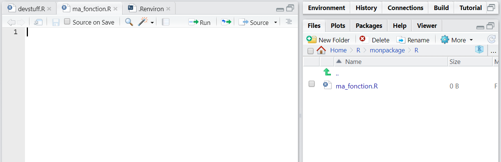
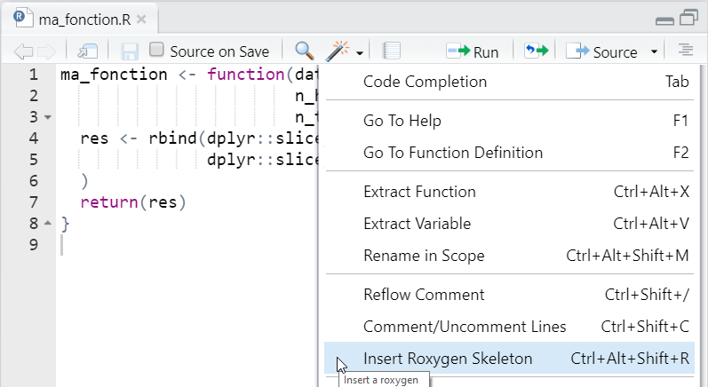
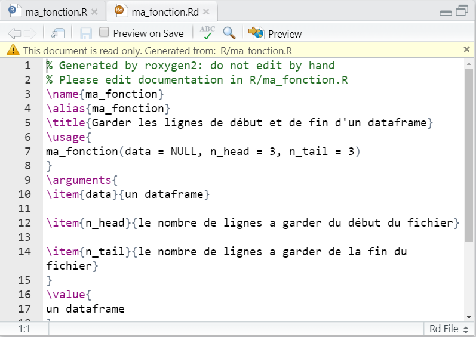
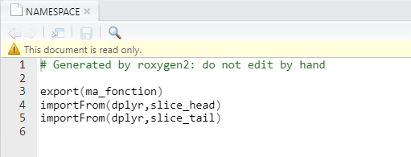

```{r setup, include=FALSE}
options(htmltools.dir.version = FALSE)
```

```{r xaringan-themer, include=FALSE, warning=FALSE}
library(xaringanthemer)
style_mono_light(
  base_color = "#000091",
  text_font_family = 'Marianne',
  code_font_family = 'Fira Code'
)
```


```{r xaringanpanelset, echo=FALSE}
xaringanExtra::use_panelset(in_xaringan = TRUE)
```

```{r share-again, echo=FALSE}
xaringanExtra::use_share_again()
```

```{r xaringan-tile-view, echo=FALSE}
xaringanExtra::use_tile_view()
```

```{r xaringan-tachyons, echo=FALSE}
xaringanExtra::use_tachyons()
```


# Qu'est ce qu'une fonction ?

Une fonction est un objet de R. C'est une opération qui prend en entrée des arguments pour produire un résultat.

Par exemple : 

- `abs()` prend comme argument un vecteur de nombre et produit un vecteur de nombre contenant la valeur absolue des nombres en argument.

- `select()` de `{dplyr}` prend comme argument un dataframe et une liste de colonne et produit en sortie un dataframe restreint à ces colonnes.

- `write.csv()` prend en argument un dataframe, un lien vers un fichier et produit en sortie un fichier csv à l'endroit spécifié par le lien contenant le dataframe.
---
# Définir une fonction

Une fonction classique dans R se définie de la sorte : 

```{r eval = FALSE}
ma_fonction <- function(a = 2,b = 1){
  resultat <- a + 2*b
  return(resultat)
}
```

L'instruction `function()` créer une fonction ici appelée `ma_function()`. 

Elle prend en argument les paramètres de notre fonction, ici `a` et `b` auxquels ont peut assigner des valeurs par défaut, ici `1`. 

L'intérieur de nos accolades `{}` va définir le résultat produit par notre fonction. Ce résultat doit être retourné par l'instruction `return()`.

Voilà comment se défini une fonction type qui produit en retour un objet R. Certaines fonctions ne produisent pas des objets R mais des instructions, comme par exemple `write.csv()` vu précédemment.


---

# Les bonnes pratiques

Pour créer une bonne fonction, il faut bien penser sa cohérence dans le workflow dans lequelle elle va s'inscrire : 

- Pour faire telle opération, dois je créer une fonction ou deux car un résultat intermédiaire pourrait m'intéresser ailleurs ? 

- Quels paramètres ? 

- Quelle complémentarité avec les fonctions existantes ?

- Quelle convention de nommage ?

Ensuite cette fonction devra être correctement documentée et testée. On verra dans la suite ce qu'est un test.

---
class: inverse, center, middle
# Rajouter une fonction dans votre package

---
#### Rajouter une fonction dans votre package

# créer le fichier .R

.pull-left[
Pour rappel, le code d'une fonction doit être rajouté dans un script R du sous répertoire `R/`.

Pour rajouter une fonction dans votre package, `{usethis}` vous facilite le travail :  `usethis::use_r("ma_fonction")` va créer un fichier `ma_fonction.R` dans votre répertoire `R/`.
]

.pull-right[

]
---
#### Rajouter une fonction dans votre package

# Rajouter votre fonction dans le fichier

.pull-left[
Ici on créé la fonction `ma_fonction` qui prend en paramètres : 

- un dataframe `data`
- deux nombres `n_head` et `n_tail`

Et produit en sortie un dataframe compilant le début et la fin du dataframe `data` en gardant `n_head` lignes du début et `n_tail` lignes de la fin.

`r emo::ji("warning")` Dans une fonction, il est commun d'utiliser des fonctions d'autres packages. Dans ce cas, appelez les en utilisant la convention `packages::fonction()`.
]

.pull-right[
```{r, eval=TRUE}
ma_fonction <- function(data = NULL,
                        n_head = 3,
                        n_tail = 3){
  res <- rbind(dplyr::slice_head(data,
                                 n = n_head),
               dplyr::slice_tail(data,
                                 n = n_tail)
  )
  return(res)
}

```

]

---

#### Rajouter une fonction dans votre package

# Utiliser votre fonction

`devtools::load_all()` vous permet de charger le contenu du package sur lequel vous travaillez comme ci vous l'aviez installé. Dans votre workflow habituel, vous allez utiliser souvent cette fonction pour tester les fonctions que vous ajoutez.

```{r, eval = FALSE}
devtools::load_all()
```

Vous pouvez ensuite constater que votre fonction marche correctement `r emo::ji("tada")`

```{r, eval = TRUE}
ma_fonction(iris,2,3)
```

---
class: inverse, center, middle
# Documenter votre fonction
---
#### Documenter votre fonction
# {roxygen2}

Le package `{roxygen2}` va vous permettre de documenter votre fonction afin qu'une aide soit accessible pour celle ci.  

---
#### Documenter votre fonction

# {roxygen2} : créer un caneva

.pull-left[
Pour ajouter une documentation, mettez le pointeur sur la fonction dans son script et utiliser le raccourci clavier `Ctrl + Alt + Shift + R` ou utiliser l'interface de Rstudio en cliquant sur `Code Tools`.
]

.pull-right[

]

---
#### Documenter votre fonction

# {roxygen2} : créer un caneva

.pull-left[
Pour ajouter une documentation, mettez le pointeur sur la fonction dans son script et utiliser le raccourci clavier `Ctrl + Alt + Shift + R` ou utiliser l'interface de Rstudio en cliquant sur `Code Tools`.

Une fois activé, roxygen2 vous rajoute un caneva de documentation.
]

.pull-right[

]
---
#### Documenter votre fonction

# {roxygen2} : compléter votre documentation

.pull-left[
Vous n'avez plus qu'à compléter `r emo::ji('tada')`! 
]
.pull-right[
```{r eval = FALSE}
#' Garder les lignes de début et de fin d'un dataframe
#'
#' @param data un dataframe
#' @param n_head le nombre de lignes à garder du début du fichier
#' @param n_tail le nombre de lignes à garder de la fin du fichier
#'
#' @return un dataframe
#' @export
#'
#' @examples
#' ma_fonction(mpg,3,3)
ma_fonction <- function(data = NULL,
                        n_head = 3,
                        n_tail = 3){
  res <- rbind(dplyr::slice_head(data,n = n_head),
               dplyr::slice_tail(data,n = n_tail)
  )
  return(res)
}
```

]
---
#### Documenter votre fonction

# {roxygen2} : gestion des dépendances

.pull-left[
`{roxygen2}` permet non seulement de gérer la documentation mais aussi les dépendances et les exports de notre package. Cela se traduit par l'alimentation du fichier `NAMESPACE`.

La balise `@importFrom` permet de préciser les fonctions qu'on utilise dans le package. Cet ajout permettra de compléter le fichier `NAMESPACE` avec les dépendances de notre package.

On ajoute une balise `@importFrom` pour chaque package utilisé.

]
.pull-right[
```{r eval = FALSE}
#' Garder les lignes de début et de fin d'un dataframe
#'
#' @param data un dataframe
#' @param n_head le nombre de lignes à garder du début du fichier
#' @param n_tail le nombre de lignes à garder de la fin du fichier
#'
#' @return un dataframe
#' @importFrom dplyr slice_head slice_tail
#' @export
#'
#' @examples
#' ma_fonction(mpg,3,3)
ma_fonction <- function(data = NULL,
                        n_head = 3,
                        n_tail = 3){
  res <- rbind(dplyr::slice_head(data,n = n_head),
               dplyr::slice_tail(data,n = n_tail)
  )
  return(res)
}
```

]
---
#### Documenter votre fonction

# {roxygen2} : gestion des exports

.pull-left[
La balise `@export` permet aussi de compléter le fichier `NAMESPACE` en lui précisant cette fois ci que `ma_fonction()` est une fonction *exportée* de `{monpackage}`. 

Si cette balise n'est pas ajoutée, dans ce cas, la fonction restera purement interne au package. Cela est une convention utile pour définir des fonctions nécessaires à d'autres fonctions du package mais pas directement utiles pour les utilisateurs.

]
.pull-right[
```{r eval = FALSE}
#' Garder les lignes de début et de fin d'un dataframe
#'
#' @param data un dataframe
#' @param n_head le nombre de lignes à garder du début du fichier
#' @param n_tail le nombre de lignes à garder de la fin du fichier
#'
#' @return un dataframe
#' @importFrom dplyr slice_head slice_tail
#' @export
#'
#' @examples
#' ma_fonction(mpg,3,3)
ma_fonction <- function(data = NULL,
                        n_head = 3,
                        n_tail = 3){
  res <- rbind(dplyr::slice_head(data,n = n_head),
               dplyr::slice_tail(data,n = n_tail)
  )
  return(res)
}
```

]
---
#### Documenter votre fonction

# {roxygen2} : document()

.pull-left[
Une fois votre documentation effectuée, la fonction `devtools::document()` va traduire ces balises en créant le fichier `ma_fonction.Rd` dans le répertoire `man/` de documentation de votre fonction et en mettant à jour le fichier NAMESPACE.

`devtools::check()` intègre `devtools::document()` donc vous aurez au départ rarement à utiliser `devtools::document()` de façon isolée.
]
.pull-right[
```{r eval = FALSE}
> devtools::document()
Updating monpackage documentation
Loading monpackage
Writing NAMESPACE
Writing NAMESPACE
Writing ma_fonction.Rd
```

]


---
#### Documenter votre fonction

# {roxygen2} : document()

.pull-left[
Une fois votre documentation effectuée, la fonction `devtools::document()` va traduire ces balises en créant le fichier **`ma_fonction.Rd`** dans le répertoire `man/` de documentation de votre fonction et en mettant à jour le fichier NAMESPACE.

`devtools::check()` intègre `devtools::document()` donc vous aurez au départ rarement à utiliser `devtools::document()` de façon isolée.
]
.pull-right[

]
---
#### Documenter votre fonction

# {roxygen2} : document()

.pull-left[
Une fois votre documentation effectuée, la fonction `devtools::document()` va traduire ces balises en créant le fichier `ma_fonction.Rd` dans le répertoire `man/` de documentation de votre fonction et en mettant à jour le fichier **NAMESPACE**.

`devtools::check()` intègre `devtools::document()` donc vous aurez au départ rarement à utiliser `devtools::document()` de façon isolée.
]
.pull-right[

]


---
class : inverse, center, middle
# Tester votre fonction
---
#### Tester votre fonction
# Qu'est ce qu'un test ?

Une fois une fonction ajoutée à votre package, vous allez créer un ou plusieurs tests la concernant.

Un test défini un comportement attendu de votre fonction.

Par exemple, on s'attend à ce que 2+2 soit égal à 4. Plus généralement on s'attend à ce qu'une addition renvoi un nombre.

Sur notre exemple de fonction, le résultat de `ma_fonction()` doit être un *dataframe*.

On va pouvoir écrire un test qui cherche à vérifier cela sur un exemple particulier.
---
#### Tester votre fonction
# Pourquoi faire un test ?

Les tests permettent de sécuriser votre développement. 

Imaginez sur notre exemple que la définition de `slice_head()` et que par exemple le paramètre `n` change de nom et devient `nb`.

Le fait d'avoir défini un test pour s'assurer sur un jeu d'exemples du résultats attendu vous permettra très vite d'identifier ce changement.


