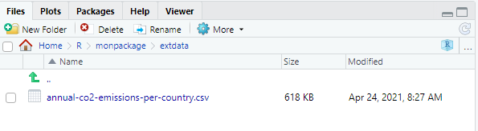

```{r setup, include=FALSE}
options(htmltools.dir.version = FALSE)
knitr::opts_chunk$set(echo = TRUE, eval=FALSE, warning=FALSE, message = FALSE)
library(sf)
```

```{r xaringan-themer, include=FALSE, warning=FALSE, eval=TRUE}
library(xaringanthemer)
style_mono_accent(
  base_color = "#000091",
  text_font_family = 'Marianne',
  code_font_family = 'Fira Code',
  background_color = 'white',
  title_slide_text_color = "#000091"
)
```


```{r xaringanpanelset, echo=FALSE, eval=TRUE}
xaringanExtra::use_panelset(in_xaringan = TRUE)
```

```{r share-again, echo=FALSE, eval=TRUE}
xaringanExtra::use_share_again()
```

```{r xaringan-tile-view, echo=FALSE, eval=TRUE}
xaringanExtra::use_tile_view()
```

```{r xaringan-tachyons, echo=FALSE, eval=TRUE}
xaringanExtra::use_tachyons()
```

```{r meta, echo=FALSE, eval=TRUE}
library(metathis)
meta() %>%
  meta_general(
    description = "Apprendre comment intégrer un dataset dans votre package.",
    generator = "xaringan et remark.js"
  ) %>% 
  meta_name("github-repo" = "maeltheuliere/ateliers_rpackage") %>% 
  meta_social(
    title = "Créer son premier package R - Rajouter un dataset dans votre package",
    url = "https://maeltheuliere.github.io/ateliers_rpackage/atelier3.html",
    image = "https://maeltheuliere.github.io/ateliers_rpackage/slides/www/slide3.png",
    image_alt = "Diapo titre du diaporama rajouter un dataset dans votre package",
    og_type = "website",
    og_author = "Juliette ENGELAERE-LEFEBVRE - Maël THEULIERE",
    twitter_card_type = "summary_large_image"
  )
```

```{r xaringanExtra-clipboard, echo=FALSE, eval=TRUE}
htmltools::tagList(
  xaringanExtra::use_clipboard(
    button_text = "<i class=\"fa fa-clipboard\"></i>",
    success_text = "<i class=\"fa fa-check\" style=\"color: #90BE6D\"></i>",
    error_text = "<i class=\"fa fa-times-circle\" style=\"color: #F94144\"></i>"
  ),
  rmarkdown::html_dependency_font_awesome()
)
```
class: center, middle

.fl.w-40.pa2[
```{r, include=TRUE,echo=FALSE, eval=TRUE, fig.width=3}
knitr::include_graphics("https://raw.githubusercontent.com/MaelTheuliere/ateliers_rpackage/main/slides/www/packagescompagnons.png")
```
]

.fl.w-60.pa2[

.f3[Créer son premier] .yellow.f3[package R]

.f1[Ajouter] .yellow.f1[un dataset] .f1[dans votre package]
]

.tr[
.f4[Juliette ENGELAERE-LEFEBVRE - Maël THEULIERE]
]
---
# Objectif de cet atelier

Après cet atelier vous saurez :

  - Ajouter un dataset dans votre package
  - Documenter votre dataset
  - Ajouter des données sous forme de fichiers plats (csv, xls, gpkg...)

---
class: inverse, center, middle

# Ajouter un dataset
---

#### Ajouter un dataset
## Documenter votre datapréparation

Un dataset que vous intégrez dans votre package vient forcément d'une source externe diverse (via un fichier plat, un sgbd, une api...) ou éventuellement d'un fichier que vous créez directement de R. 
Ce fichier a pu être retraité pour arriver dans votre package. 

Vous aurez donc besoin de documenter ce processus de datapréparation. La convention dans ce cas dans R est d'avoir un répertoire `data-raw/` qui contient ces scripts.

---
#### Ajouter un dataset
## Documenter votre datapréparation  
`{usethis}` vous facilite là aussi ce travail !

Imaginons que nous voulions intégrer dans notre package un fichier contenant les séries sur les [émissions globales de CO2](https://ourworldindata.org/co2-emissions).  

.pull-left[
`usethis::use_data_raw(name = "co2_emission")` (dans le dev_history.R) va créer :   

- un fichier `co2_emission.R` dans le dossier data_raw, 
- l'ouvrir pour que vous y inscriviez le code de préparation des données, 
- et ajoute directement l'instruction à utiliser en fin de course, pour stocker votre dataset dans le package, une fois celui-ci généré : `usethis::use_data(co2_emission, overwrite = TRUE)`.  
]

.pull-right[
```{r, echo=FALSE,eval=TRUE}
knitr::include_graphics("www/usethis_use_data_raw.png")
```

]

---
#### Ajouter un dataset
## Stocker la donnée source


Où mettre vos données sources ? Si vous importez vos données d'un fichier plat, la bonne pratique va être de mettre votre fichier source dans votre projet tout en l'excluant du package, car vos utilisateurs n'auront pas besoin de ce fichier intermédiaire.

Vous pouvez par exemple les rajouter dans un répertoire `extdata/` à la racine de votre projet. 

Puis utiliser `usethis::use_build_ignore("extdata/")` pour que ce répertoire ne soit pas compris comme faisant parti du package par R.
---
#### Ajouter un dataset
## Stocker la donnée source

**Mise en pratique :**

.pull-left[
>    

>1. créer le répertoire `extdata/` à la racine du projet `{monpremierpackage}`
>2. y télécharger le jeu de données  [`annual-co2-emissions-per-country.csv`](https://ourworldindata.org/co2-emissions) `r emo::ji("down_arrow")`
>3. sortir le répertoire `extdata/` des répertoires pris en compte dans la compilation du package, càd consigner `usethis::use_build_ignore("extdata/")` dans le dev_history.R et l'exécuter. 

]

.pull-right[
```{r, echo=FALSE,eval=TRUE}

```
]

---
#### Ajouter un dataset
## Stocker la donnée source

Si ce fichier est au format tableur, privilégier l'usage du csv qui peut être historisé par git, contrairement aux fichiers xls ou ods.

`r emo::ji("warning")` Ceci ne sera optimum que pour des fichiers source de ***petite taille***. 

Si votre fichier de départ est vraiment très volumineux, et que vous êtes amené.e à le mettre à jour régulièrement, cette pratique est à proscrire, car le poids de votre projet git deviendra déraisonnable. 

Il vaut mieux dans ce cas, au choix : 

- Charger votre donnée de départ dans un SGBD ; 
- Privilégier l'usage d'une API si elle existe ; 
- Utiliser les fonctions de téléchargement distant de R dans votre script de datapréparation pour que celui ci intègre le téléchargement depuis l'url où se trouve le fichier si celui-ci est disponible via url.

---
#### Ajouter un dataset
## Coder votre datapréparation

Ici la datapréparation est assez sommaire, on se contente d'importer le fichier csv et de lui attribuer des noms de colonnes en format snake case.

```{r, eval = FALSE}
## code to prepare `co2_emission` dataset goes here

library(readr)
library(purrr)
co2_emission <- read_csv("extdata/annual-co2-emissions-per-country.csv") %>%
  set_names("entity","code","year","annual_co2_emissions")

usethis::use_data(co2_emission, overwrite = TRUE)
```

.pull-right[*fichier `data-raw/co2_emission.R`*]

---
#### Ajouter un dataset
## Coder votre datapréparation

.pull-left[
Une fois votre script de fin de datapréparation lancé, vous aurez un message dans la console qui vous précise ce que fait R : 

- Changement du fichier DESCRIPTION
- Création d'un répertoire `data/`
- Création d'un fichier `co2_emission.rda` dans ce répertoire

Et on vous invite à documenter votre dataset.
]

.pull-right[
```{r, echo=FALSE,eval=TRUE}
knitr::include_graphics("www/use_data.png")
```

]
---
#### Ajouter un dataset
## Documenter votre dataset

Pour documenter votre dataset, vous allez devoir créer un fichier `data.R` dans votre répertoire `R/`. Et utiliser une syntaxe Roxygen spécifique aux datasets.

```{r, eval = FALSE}
#' Emissions annuelles de CO2 par pays
#'
#' Un dataset contenant pour chaque pays et année les émmissions annuelles de CO2
#'
#' @format Un data frame avec 23170 lignes and 4 variables:
#' \describe{
#'   \item{entity}{Libellé du pays ou de la zone}
#'   \item{code}{Code du pays ou de la zone}
#'   \item{year}{Année de l'observation}
#'   \item{annual_co2_emissions}{Emmissions annuelles de CO2}
#' }
#' @source \url{https://ourworldindata.org/co2-emissions}
"co2_emission"
```

---
#### Ajouter un dataset
## Documenter votre dataset

.pull-left[
Cette documentation se traduira ensuite par une page spécifique d'aide dans votre package.
]

.pull-right[
```{r, echo=FALSE,eval=TRUE}

```
]
---
#### Ajouter un dataset
## Documenter votre dataset
.pull-left[
Un package maison, **non encore stabilisé**, peut vous faire gagner du temps pour cette étape. 
La fonction `use_data_doc()`, à consigner dans le dev_history.R :  

- crée le fichier dans votre répertoire `R/`,  
- initie son contenu,   
- et l'ouvre pour être complété.  
]

.pull-right[
```{r, echo=TRUE,eval=FALSE}
remotes::install_gitlab("dreal-datalab/utilitaires.ju")
library(utilitaires.ju)
use_data_doc("co2_emission", description = "Emissions annuelles de CO2 par pays", 
             source = "https://ourworldindata.org/co2-emissions")

```
```{r, echo=FALSE,eval=TRUE}

```
]
---
#### Ajouter un dataset
## Utiliser votre dataset

.pull-left[
Votre fichier sera maintenant disponible dès que vous appelez votre package avec `library()`.

> Pour le tester, vous pouvez utiliser `devtools::load_all()` et appeler votre dataset `co2_emissions`.
]

.pull-right[
```{r, echo=FALSE,eval=TRUE}
knitr::include_graphics("www/load_all_data.png")
```
]
---
class: inverse, center, middle

# Ajouter un fichier plat
---
#### Ajouter un fichier plat
## Pourquoi ajouter un fichier plat dans votre package ?

Ajouter un fichier plat peut servir de plusieurs façon : 

- Disposer de données pour des tests
- Disposer de données d'exemple pour des fonctions d'importation
- Disposer de données pour des vignettes

Ces données doivent être situées par convention dans un répertoire `inst/extdata`.

`r emo::ji("memo")` Lors de l'installation du package, le contenu du répertoire `inst/` est intégralement copié à la racine du répertoire du package. On peut rajouter ce que l'on veut dans ce répertoire. 

Attention toutefois de ne pas utiliser des noms de répertoire déjà utilisés par R par convention comme par exemple `data/`.
---
#### Ajouter un fichier plat
## Charger votre fichier plat

On va ici ajouter un fichier géomatique (format geopackage) correspondant aux frontières des pays.

.pull-left[
>- Télécharger [ce fichier](https://github.com/tsamsonov/r-geo-course/raw/master/data/ne/countries.gpkg)
>- Créer un répertoire `inst/extdata` dans votre package

>- Placer le fichier dans le répertoire
]

.pull-right[
```{r, echo=FALSE,eval=TRUE}
knitr::include_graphics("www/inst_extdata.png")
```
]
---

#### Ajouter un fichier plat
## Comment exploiter votre fichier

Pour utiliser votre fichier, les utilisateurs de votre package vont devoir aller le chercher à l'endroit où il se trouve après l'installation du package. Mais cet emplacement va dépendre de chaque utilisateur, suivant son système d'exploitation ou ses options de configuration par exemple.

La fonction `system.file()` permet de régler ce problème en reconstituant le chemin d'accès de ce fichier sur le poste de l'utilisateur. 
Elle prend en paramètre le nom du package et le chemin d'accès de votre fichier dans ce package.

```{r}
countries_files <- system.file("extdata", "countries.gpkg", package = "monpremierpackage")
```
---

#### Ajouter un fichier plat
## Comment exploiter votre fichier

On peut ensuite utiliser ce chemin pour par exemple importer notre fichier gpkg avec `{sf}`.

```{r, echo=FALSE, eval = TRUE}
countries_files <- "www/countries.gpkg"
```

.pull-left[
```{r countries, eval = FALSE, echo = TRUE }
countries <- sf::read_sf(countries_files)
plot(countries[,1])
```
]

.pull-right[
```{r countries-out, ref.label="countries", eval = TRUE, echo = FALSE, fig.height=4}
```

]

