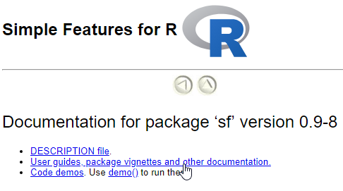
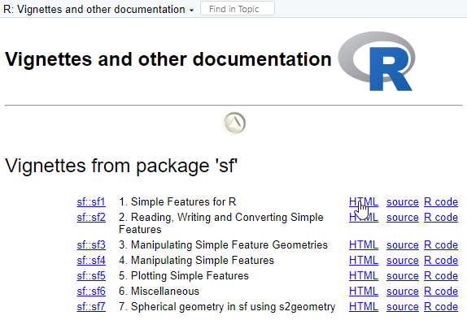
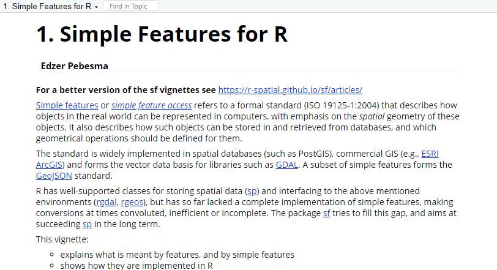
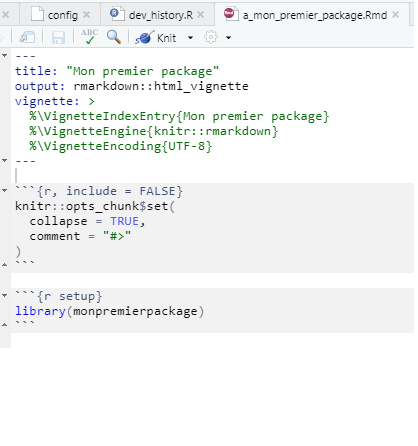
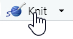
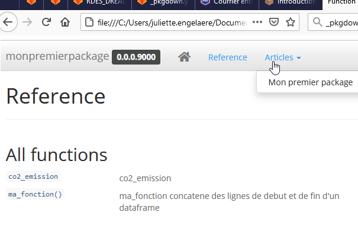

```{r setup, include=FALSE}
options(htmltools.dir.version = FALSE)
knitr::opts_chunk$set(echo = TRUE, eval=FALSE, warning=FALSE, message = FALSE)
```

```{r xaringan-themer, include=FALSE, warning=FALSE, eval=TRUE}
library(xaringanthemer)
style_mono_accent(
  base_color = "#000091",
  text_font_family = 'Marianne',
  code_font_family = 'Fira Code',
  background_color = 'white',
  title_slide_text_color = "#000091"
)
```


```{r xaringanpanelset, echo=FALSE, eval=TRUE}
xaringanExtra::use_panelset(in_xaringan = TRUE)
```

```{r share-again, echo=FALSE, eval=TRUE}
xaringanExtra::use_share_again()
```

```{r xaringan-tile-view, echo=FALSE, eval=TRUE}
xaringanExtra::use_tile_view()
```

```{r xaringan-tachyons, echo=FALSE, eval=TRUE}
xaringanExtra::use_tachyons()
```

```{r meta, echo=FALSE, eval=TRUE}
library(metathis)
meta() %>%
  meta_general(
    description = "Apprendre comment ajouter des vignettes dans votre package et lui construire un site de présentation.",
    generator = "xaringan et remark.js"
  ) %>% 
  meta_name("github-repo" = "maeltheuliere/ateliers_rpackage") %>% 
  meta_social(
    title = "Créer son premier package R - Ajouter des vignettes et un site de documentation",
    url = "https://maeltheuliere.github.io/ateliers_rpackage/atelier4.html",
    image = "https://maeltheuliere.github.io/ateliers_rpackage/slides/www/slide4.png",
    image_alt = "Diapo titre du diaporama Ajouter des vignettes et un site de documentation",
    og_type = "website",
    og_author = "Juliette ENGELAERE-LEFEBVRE - Maël THEULIERE",
    twitter_card_type = "summary_large_image"
  )
```

```{r xaringanExtra-clipboard, echo=FALSE, eval=TRUE}
htmltools::tagList(
  xaringanExtra::use_clipboard(
    button_text = "<i class=\"fa fa-clipboard\"></i>",
    success_text = "<i class=\"fa fa-check\" style=\"color: #90BE6D\"></i>",
    error_text = "<i class=\"fa fa-times-circle\" style=\"color: #F94144\"></i>"
  ),
  rmarkdown::html_dependency_font_awesome()
)
```
class: center, middle

.fl.w-40.pa2[
```{r, include=TRUE,echo=FALSE, eval=TRUE, fig.width=3}
knitr::include_graphics("https://raw.githubusercontent.com/MaelTheuliere/ateliers_rpackage/main/slides/www/packagescompagnons.png")
```
]

.fl.w-60.pa2[

.f3[Créer son premier] .yellow.f3[package R]

.f1[Ajouter des ] .yellow.f1[vignettes] .f1[ et un ] .yellow.f1[site de documentation] .f1[dans votre package]
]

.tr[
.f4[Juliette ENGELAERE-LEFEBVRE - Maël THEULIERE]
]
---
# Objectif de cet atelier

Après cet atelier vous saurez :

  - Ce qu'est une vignette de package  
  
  - Installer un package en incluant les vignettes  
  
  - Ajouter une vignette dans votre package   
  
  - Rassembler la documentation du package sous forme de site   
  
  - Avoir des notions sur le déploiement de votre site grâce à l'intégration continue  

---
class: inverse, center, middle

# Mais qu'est ce qu'une vignette ?
---

#### Qu'est ce qu'une vignette ?
## Pourquoi une vignette ?

La vignette est une page html ou pdf, incorporée dans le package qui présente des exemples d'usages des fonctions, leur syntaxe et leurs résultats, entremêlés de commentaires. 
Elle est produite par un script Rmarkdown lui aussi accessible dans le package.  
Elle complète, de manière facultative, la documentation conventionnelle obligatoire de chacune des fonctions.  


Leur utilité est multiple :  

- présenter à l'utilisateur  :   
  - à quels usages le package sert et pour quels besoins il a été conçu,  
  - comment il fonctionne, généralement, en commençant par comment il s'installe,   
  - et sa logique d'ensemble, en présentant successivement plusieurs fonctions du package ;
  
- proposer un tutoriel ;
  
- vérifier en plus de tests que chaque fonction produit les résultats attendus ; 

- ou encore, dialoguer avec le commanditaire d'une publication propre, pour lui présenter le résultat de l'exécution de chaque brique développée, grâce à l'intégration continue.  

---
#### Qu'est ce qu'une vignette ?
## Exemple du package `{sf}` : accès

.pull-left[
> Depuis le panneau "Packages" (en bas à droite),   

> sélectionner `{sf}`   

> et cliquer sur _User guides, package vignettes and other documentation_   

> pour avoir accès aux 7 vignettes proposées.  

]

.pull-right[
```{r, echo=FALSE,eval=TRUE}

```
]
---
#### Qu'est ce qu'une vignette ?
## Exemple du package `{sf}` : les vignettes disponibles  
.pull-left[
On a accès :  

- à la vignette compilée : `HTML`   
  (certains packages proposent plutôt `PDF`),  
  
- au document Rmd source : `source`,    

- aux seules portions de code : `R code`.  

L'aide de R est inadaptée si on ne connaît pas le nom de la fonction dont on a besoin. 
Parcourir une vignette permet de découvrir de nouvelles fonctions. 

]
.pull-right[
```{r, echo=FALSE,eval=TRUE}

```
]
---
#### Qu'est ce qu'une vignette ?
## Exemple du package `{sf}` : vignette 1 

Le lien [https://r-spatial.github.io/sf/articles/](https://r-spatial.github.io/sf/articles/) invite à consulter la vignette sur le web, produite par l'intégration continue du [repo sf github](https://github.com/r-spatial/sf).

```{r, echo=FALSE,eval=TRUE}

```
---

#### Qu'est-ce qu'une vignette ?
## Accéder aux vignettes disponibles sur mon poste 

La fonction `vignette()` retourne une liste des vignettes disponibles. 
Cette liste peut être globale et concerner l’ensemble des packages installés, ou partielle en se limitant aux packages en cours d'utilisation avec l'argument `all=FALSE`, ou encore se restreindre à un seul package avec l'argument `package = "DBI" ` par exemple, pour lister les seules vignettes du package `{DBI}`.  

```{r echo=TRUE, eval=TRUE}
vign <- vignette(all=FALSE)
vign$results[, c("Package", "Title")]
```
Sa petite soeur `browseVignettes(all = FALSE)` utilise les mêmes arguments et facilite la navigation HTML.  
---
class: inverse, center, middle

# Installer un package en incluant les vignettes

---
#### Installer un package en incluant les vignettes  
## Les vignettes ne sont pas systématiquement installées avec le packages   

C'est même le comportement par défaut lorsqu'un package est installé via `remotes::install_github` ou `remotes::install_gitlab` ou le bouton 
`r knitr::include_graphics("www/vignettes_install_restart.png")` du panneau 'Build'.    

Les raisons ?     
- cela est consommateur de temps : la vignette est compilée sur votre poste de bout en bout,

- la compilation des vignettes peut échouer si les dépendances ne sont pas les mêmes que celles du package,   

- généralement les vignettes sont déjà accessibles sur gitlab ou github pages.   
---
#### Installer un package en incluant les vignettes  
## Installer localement les vignettes   

.pull-left[
Et pourquoi ça ?      

- naviguer dans l'ensemble de l'aide depuis RStudio,    

- vérifier que le package fonctionne correctement sur mon poste.    

]


.pull-right[
```{r, echo=TRUE, eval=FALSE}
remotes::install_gitlab(repo = "dreal-datalab/bilan.eco.insee",
                        build_vignettes = TRUE)

remotes::install_github("MaelTheuliere/COGiter", 
                        build_vignettes = TRUE)
```
]

---
class: inverse, center, middle

#  Ajouter une vignette dans notre package  
---
#### Ajouter une vignette dans notre package 
## `{usethis}` à la rescousse !

.pull-left[
- L'instruction `usethis::use_vignette()` simplifie considérablement l'ajout d'une vignette dans un package.  

- La fonction `use_vignette()` prend deux arguments :   
  - `name` : le nom du fichier vignette,    
  - et `title` : le titre de la vignette.   
]

.pull-right[
Placez dans le dev_history.R :  
```{r, echo=TRUE, eval=FALSE}
usethis::use_vignette(name = "a_mon_premier_package", 
                      title = "Mon premier package")
```
et exécutez cette instruction.
]   

<br>

> `r emo::ji("bulb")`   
> En cas de vignettes multiples, si on souhaite ordonner les vignettes pour proposer une progression logique, penser à classer par ordre alphabétique les noms de fichiers .  

---
#### Ajouter une vignette dans notre package 
## Comportement de `usethis::use_vignette()`

.pull-left[
  
- Cette instruction va :  

  - compléter DESCRIPTION avec les dépendances nécessaires à la compilation de la vignette à l'installation du package,   
  
  - compléter le .gitignore,    
  
  - créer le répertoire des vignettes,   
  
  - créer le fichier vignette "nom_fichier.Rmd", initier son contenu et l'ouvrir.
]

.pull-right[
```{r, echo=TRUE, eval=FALSE}
usethis::use_vignette(name = "a_mon_premier_package", title = "Mon premier package")
√ Setting active project to 'C:/Users/juliette.engelaere/Documents/Travail/R_local/archives/monpremierpackage'
√ Adding 'knitr' to Suggests field in DESCRIPTION
√ Setting VignetteBuilder field in DESCRIPTION to 'knitr'
√ Adding 'inst/doc' to '.gitignore'
√ Creating 'vignettes/'
√ Adding '*.html', '*.R' to 'vignettes/.gitignore'
√ Adding 'rmarkdown' to Suggests field in DESCRIPTION
√ Writing 'vignettes/a_mon_premier_package.Rmd'
> Modify 'vignettes/a_mon_premier_package.Rmd'
```
]
<!-- docu ju  -->
<!-- https://ericmarcon.github.io/travailleR/chap-package.html#vignette-et-pkgdown    -->
<!-- https://r-pkgs.org/vignettes.html    -->
<!-- https://bookdown.org/yihui/rmarkdown-cookbook/package-vignette.html    -->

---
#### Ajouter une vignette dans votre package 
## Description du fichier ouvert

.pull-left[
- une en-tête YAML ; 

- un premier chunk de paramétrage des options de compilation du document,  
adaptées aux vignettes  
et invisible dans le document final (compilé) ;  

- un second chunk 'setup' qui marque le début de l'histoire à raconter. 

]

.pull-right[
```{r, echo=FALSE, eval=TRUE}

```
]
---
#### Ajouter une vignette dans votre package 
## Compléter la vignette

On utilise la [syntaxe légère de mise en forme markdown](https://github.com/adam-p/markdown-here/wiki/Markdown-Cheatsheet) pour le texte.

On met les exemples de code dans des chunks, càd entre 2 séries de 3 ` avec {r nom_du_chunk, options} au début :    

````markdown  
`r ''````{r, eval = FALSE}
mon_resultat <- ma_fonction
mon_resultat
```    
```` 
Si l'option `eval` est fixée à `TRUE`, le résultat sera affiché sous l'instruction dans le document compilé.    

On compile le document avec le bouton knit 
pour visualiser le rendu.  

Pour en savoir plus sur l'utilisation de Rmarkdown :   
- une [initiation en français](https://lms.fun-mooc.fr/c4x/UPSUD/42001S02/asset/RMarkdown.html) ;
- une [feuille de triche](https://raw.githubusercontent.com/rstudio/cheatsheets/master/rmarkdown-2.0.pdf) ;   
- le [guide complet](https://bookdown.org/yihui/rmarkdown-cookbook/).  

---
#### Ajouter une vignette dans votre package 
## Compléter la vignette

.pull-left[
Indiquer par exemple :  

- comment s'installe le package  

- que le package contient une fonction et un dataset   

- et appliquer la fonction au dataset  

Et _kniter_ pour visualiser le rendu.   


.center[   ]
]

.pull-right[

````markdown  
Le package R `{monpremierpackage}` s'installe depuis gitlab avec :  

`r ''````{r install, eval=FALSE}
remotes::install_gitlab(repo = "jengelaere/monpremierpackage")
```

`r ''````{r setup}
library(monpremierpackage)
```

`{monpremierpackage}` contient une fonction `ma_fonction()` qui concatène des lignes de début et de fin d'un dataframe. 
On utilise le paramètre `n_head` pour indiquer le nombre de lignes du début à conserver, et le paramètres `n_tail` pour le nb de lignes de la fin.

Il contient également un jeu de données d'exemple `co2_emission`, présentant les émissions annuelles de CO~2~ par pays.


`r ''````{r exemple}
mon_resultat <- ma_fonction(data = co2_emission, n_head = 3, n_tail = 2 )
mon_resultat
```
````
] 


---
class: inverse, center, middle

# Et si, avec cette documentation rédigée, on faisait un site web de présentation du package ?    
  
---
#### Produire un site pour notre package 
## {pkgdown} est là pour ça 

.pull-left[
```{r, echo=FALSE,eval=TRUE}
knitr::include_graphics("www/pkgdown_logo.png")
```
]

.pull-right[
.middle[

Il rassemble la documentation de notre package sous la forme de site web,  
avec un **minimum d'efforts**.]


]
---
#### Produire un site pour notre package   
## {usethis} encore et toujours `r emo::ji("superhero")`  

.pull-left[
Dans le _dev.history.R_,   

1. saisir `usethis::use_pkgdown()` et l'exécuter pour initier la création du site.

 + Des répertoires et fichiers sont ajoutés à la liste des choses à ignorer pour la compilation et le suivi par git.  

 + Le fichier de paramétrages complémentaires du site '_pkgdown.yml' est créé et ouvert.  
**Il est facultatif !**  

2. saisir `pkgdown::build_site()` dans le _dev_history.R_, pour terminer.
]

.pull-right[
```{r, include = TRUE, eval = FALSE}
usethis::use_pkgdown()
# Setting active project to 'C:/Users/juliette.engelaere/Documents/Travail/R_local/archives/monpremierpackage'
# Adding '^_pkgdown\\.yml$', '^docs$' to '.Rbuildignore'
# Adding '^pkgdown$' to '.Rbuildignore'
# Adding 'docs' to '.gitignore'
# Record your site's url in the pkgdown config file (optional, but recommended)
# Modify '_pkgdown.yml'
pkgdown::build_site()
```
]

Plus d'info sur le paramétrage de notre site sur la [vignette de {pkgdown}](https://pkgdown.r-lib.org/articles/pkgdown.html), voir un [exemple basique ici](https://gitlab.com/dreal-datalab/bilan.eco.insee/-/blob/master/_pkgdown.yml).  


---
#### Produire un site pour notre package  
.pull-left[
```{r, include = TRUE, eval = FALSE}
== Building pkgdown site =======================================================
Reading from: 'C:/Users/juliette.engelaere/Documents/Travail/R_local/archives/monpremierpackage'
Writing to:   'C:/Users/juliette.engelaere/Documents/Travail/R_local/archives/monpremierpackage/docs'
-- Initialising site -----------------------------------------------------------
Copying '../../../../R/win-library/4.0/pkgdown/assets/bootstrap-toc.css' to 'bootstrap-toc.css'
Copying '../../../../R/win-library/4.0/pkgdown/assets/bootstrap-toc.js' to 'bootstrap-toc.js'
Copying '../../../../R/win-library/4.0/pkgdown/assets/docsearch.css' to 'docsearch.css'
Copying '../../../../R/win-library/4.0/pkgdown/assets/docsearch.js' to 'docsearch.js'
Copying '../../../../R/win-library/4.0/pkgdown/assets/link.svg' to 'link.svg'
Copying '../../../../R/win-library/4.0/pkgdown/assets/pkgdown.css' to 'pkgdown.css'
Copying '../../../../R/win-library/4.0/pkgdown/assets/pkgdown.js' to 'pkgdown.js'
Writing '404.html'
-- Building home ---------------------------------------------------------------
Writing 'authors.html'
Reading 'LICENSE.md'
Writing 'LICENSE.html'
-- Building function reference -------------------------------------------------
Writing 'reference/index.html'
Reading 'man/co2_emission.Rd'
Writing 'reference/co2_emission.html'
Reading 'man/ma_fonction.Rd'
Writing 'reference/ma_fonction.html'
-- Building articles -----------------------------------------------------------
Writing 'articles/index.html'
Reading 'vignettes/a_mon_premier_package.Rmd'
Writing 'articles/a_mon_premier_package.html'
== DONE ========================================================================
-- Previewing site -------------------------------------------------------------------------------
```
]

.pull-right[
```{r, echo=FALSE,eval=TRUE}

```
]  

---
#### Produire un site pour notre package  
## Notre site est prêt ! `r emo::ji("tada")` 

On a maintenant un magnifique site présentant notre package, mais assez difficile d'accès pour l'utilisateur.  

Ce dernier peut y avoir accès, une fois notre package installé, via :  

`monpremierpackage::open_pkgdown()` 

Faut le savoir !


---
class: inverse, center, middle

# Et maintenant ? Déployons notre site grâce à l'intégration continue 


---
#### Publier notre site grâce avec la CI 
## La quoi ?  

- CI = continuous integration  

- un ensemble d'opérations programmées, 

- exécutées par gitlab ou github à chaque push,   

- qui peuvent :  
  - tester notre package, 
  - publier ou mettre à jour notre site, 
  - publier ou mettre à jour notre application shiny...

Les instructions sont définies dans un fichier YAML, par exemple `.gitlab-ci.yml` pour gitlab, voire dans un dossier de plusieurs fichiers YAML pour Github `.github`.
---
#### Publier notre site grâce avec la CI 
## Exemples
.pull-left[     
### Gitlab    

`usethis::use_gitlab_ci()`    
> √ Writing '.gitlab-ci.yml'  
> √ Adding '^\\.gitlab-ci\\.yml$' to '.Rbuildignore'  

Fichier `.gitlab-ci.yml` à compléter, notamment au niveau de l'étape _pages_

Un [exemple Gitlab pour un package](https://gitlab.com/dreal-datalab/bilan.eco.insee/-/blob/master/.gitlab-ci.yml)
]

.pull-right[
### Github  

{usethis} propose plus de fonctions pour Github : une dizaine dédiées à l'intégration continue Github.  

`usethis::use_github_actions` -> la plus générique   

`usethis::use_github_pages()` -> publier du HTML  

`usethis::use_pkgdown_github_pages()` -> publier un site pkgdown

Un [exemple concernant ce support d'atelier](https://github.com/MaelTheuliere/ateliers_rpackage/blob/main/.github/workflows/distill.yaml)

En [savoir plus sur l'intégration continue sur Github](https://ericmarcon.github.io/travailleR/chap-ci.html) 
]

---

#### Publier notre site grâce avec la CI
## Accéder aux résultats de la CI sur gitlab
### Gitlab  
- En cas d'échec un mail est envoyé au propriétaire du projet  
- Aperçu du menu pipelines et CI de gitlab  
- Aperçu du menu settings/pages pour retrouver le lien vers le site  
- Aperçu du menu settings/continuous integration pour le lien vers le code coverage et les badges  

---
class: inverse, center, middle


# Merci de votre attention `r emo::ji("pray")`

