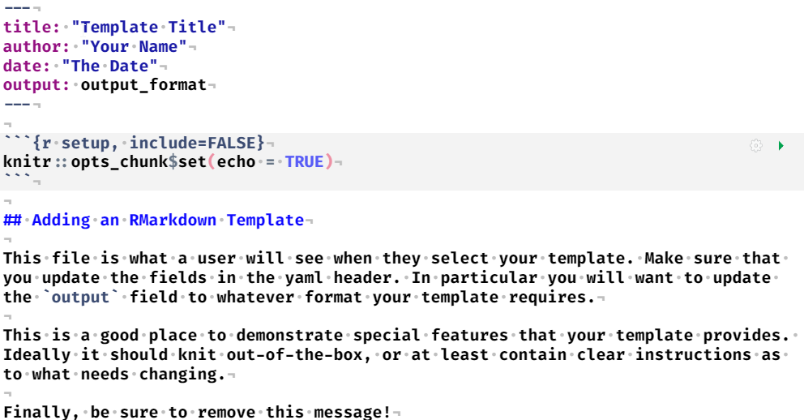
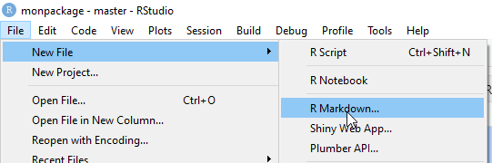
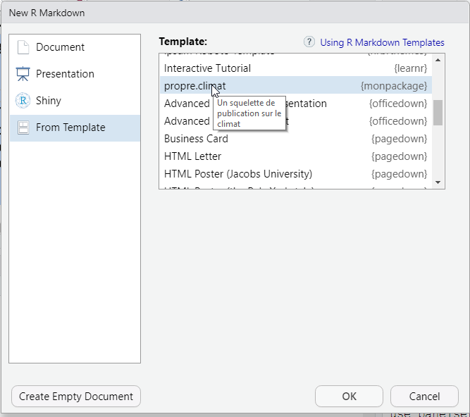
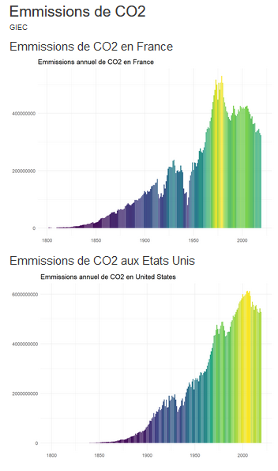

```{r setup, include=FALSE}
options(htmltools.dir.version = FALSE)
knitr::opts_chunk$set(echo = TRUE, eval=FALSE, warning=FALSE, message = FALSE)
```

```{r xaringan-themer, include=FALSE, warning=FALSE, eval=TRUE}
library(xaringanthemer)
style_mono_accent(
  base_color = "#000091",
  text_font_family = 'Marianne',
  code_font_family = 'Fira Code',
  background_color = 'white',
  title_slide_text_color = "#000091"
)
```


```{r xaringanpanelset, echo=FALSE, eval=TRUE}
xaringanExtra::use_panelset(in_xaringan = TRUE)
```

```{css echo=FALSE}
.panelset {
  --panel-tabs-sideways-max-width: 33%;
}
```

```{r share-again, echo=FALSE, eval=TRUE}
xaringanExtra::use_share_again()
```

```{r xaringan-tile-view, echo=FALSE, eval=TRUE}
xaringanExtra::use_tile_view()
```

```{r xaringan-tachyons, echo=FALSE, eval=TRUE}
xaringanExtra::use_tachyons()
```

```{r meta, echo=FALSE, eval=TRUE}
library(metathis)
meta() %>%
  meta_general(
    description = "Apprendre comment ajouter des templates Rmarkdown à un package",
    generator = "xaringan et remark.js"
  ) %>% 
  meta_name("github-repo" = "maeltheuliere/ateliers_rpackage") %>% 
  meta_social(
    title = "Ajouter des templates Rmarkdown à votre package",
    url = "https://maeltheuliere.github.io/ateliers_rpackage/atelier5.html",
    image = "https://maeltheuliere.github.io/ateliers_rpackage/slides/www/slide5.png",
    image_alt = "Diapo titre du diaporama Ajouter des templates Rmarkdown à votre package",
    og_type = "website",
    og_author = "Juliette ENGELAERE-LEFEBVRE - Maël THEULIERE",
    twitter_card_type = "summary_large_image"
  )
```

```{r xaringanExtra-clipboard, echo=FALSE, eval=TRUE}
htmltools::tagList(
  xaringanExtra::use_clipboard(
    button_text = "<i class=\"fa fa-clipboard\"></i>",
    success_text = "<i class=\"fa fa-check\" style=\"color: #90BE6D\"></i>",
    error_text = "<i class=\"fa fa-times-circle\" style=\"color: #F94144\"></i>"
  ),
  rmarkdown::html_dependency_font_awesome()
)
```
class: center, middle

.fl.w-40.pa2[
```{r, include=TRUE,echo=FALSE, eval=TRUE, fig.width=3}
knitr::include_graphics("https://raw.githubusercontent.com/MaelTheuliere/ateliers_rpackage/main/slides/www/packagescompagnons.png")
```
]

.fl.w-60.pa2[

.f3[Créer son premier] .yellow.f3[package R]

.f1[Ajouter des ] .yellow.f1[templates rmarkdown] .f1[dans votre package]
]

.tr[
.f4[Juliette ENGELAERE-LEFEBVRE - Maël THEULIERE]
]
---
# Objectif de cet atelier

Après cet atelier vous saurez :

  - Ajouter un template rmarkdown à votre package
  
  - Ajouter un template bookdown à votre package
  
---
# Pourquoi des templates de publication ?

Une publication statistique peut être pensée dans son processus de travail comme un livrable d'un package : 

- des données insérer dans le package
- une datapréparation documentée dans dataraw
- des fonctions qui produisent les illustrations (tableaux, graphiques, cartes, chiffres clefs...)
- un squelette de publication qui intègre ces éléments précalculés
- un système de versionning pour gérer le développement et les millésimes de la publication

C'est la démarche PROPRE et tout cela est mieux documenté dans le [document de présentation de la démarche](https://rdes_dreal.gitlab.io/propre/index.html).
---
# Comment insérer un template de publication ?

### `r emo::ji("superhero")` {`usethis`} off course !

`usethis::use_rmarkdown_template()` est la fonction de `{usethis}` qui permet cela. Elle vous positionne au bon endroit les bons fichiers pour créer un template.

```{r}
usethis::use_rmarkdown_template(template_name = "propre.climat",
                                template_description = "Un squelette de publication sur le climat")
```

```md
√ Setting active project to 'C:/Users/mael.theuliere/Documents/R/monpackage'
√ Creating 'inst/rmarkdown/templates/propre-climat/skeleton/'
√ Writing 'inst/rmarkdown/templates/propre-climat/template.yaml'
√ Writing 'inst/rmarkdown/templates/propre-climat/skeleton/skeleton.Rmd'
```

---
# Comment insérer un template de publication ?

.pull-left[
Vous pouvez l'ouvrir en allant dans le répertoire `inst/rmarkdown/templates/propre-climat/skeleton`.

Ou directement : 

```{r, eval = FALSE}
rstudioapi::navigateToFile("inst/rmarkdown/templates/propre-climat/skeleton/skeleton.Rmd")
```

]

.pull-right[
```{r, echo=FALSE,eval=TRUE}

```
]
---
# Comment développer notre squelette ?

Le processus de travail est bien documenté dans la démarche PROPRE.

Voyons ici un exemple minimal en ajoutant une fonction de valorisation de nos données. 
.panelset.sideways[
.panel[.panel-name[Creer la fonction]

```{r}
usethis::use_r("creer_graphique_co2")
```

Insérer ce code : 
```{r}
#' graphique sur le CO2
#'
#' @param code_pays Code iso a3 du pays
#'
#' @return un ggplot
#' @export
#' @importFrom dplyr filter
#' @importFrom ggplot2 ggplot geom_col scale_fill_viridis_c theme_minimal theme labs
#' @importFrom rlang .data
#' @examples
#' creer_graphique_co2("FRA")
creer_graphique_co2 <- function(code_pays) {
  df <- dplyr::filter(monpackage::co2_emission, .data$code == code_pays)
  nom_pays <- unique(df$entity)
  graphique <- ggplot2::ggplot(data = df) +
    ggplot2::geom_col(ggplot2::aes(x = .data$year,
                                   y = .data$annual_co2_emissions,
                                   fill = .data$annual_co2_emissions)
                      ) +
    ggplot2::scale_fill_viridis_c() +
    ggplot2::theme_minimal() +
    ggplot2::theme(legend.position = "none") +
    ggplot2::labs(title = paste("Emmissions annuel de CO2 en", nom_pays), x=NULL,y=NULL)
  return(graphique)
}

```
]
.panel[.panel-name[Ajouter les dépendances]
```{r}
usethis::use_package("dplyr")
usethis::use_package("ggplot2")
usethis::use_package("rlang")
```
]
.panel[.panel-name[Insérer la fonction dans votre template]

````
---
title: "Emmissions de CO2"
author: "GIEC"
date: ""
output: html_document
---

```{r setup, include=FALSE}`r ''`
knitr::opts_chunk$set(echo = FALSE)
library(monpackage)
```

## Emmissions de CO2 en France

```{r}`r ''`
creer_graphique_co2("FRA")
```

## Emmissions de CO2 aux Etats Unis

```{r}`r ''`
creer_graphique_co2("USA")
```

````

]
.panel[.panel-name[Relancer le check et l'installation]
```{r}
devtools::check()
devtools::install()
.rs.restartR()
```
]
.panel[.panel-name[Découvrez votre template]
.pull-left[
```{r, eval=TRUE, echo=FALSE}

```
]
.pull-right[
```{r, eval=TRUE, echo=FALSE}

```
]

]
]
---
.fl.w-60.pa2[
```{r, eval=TRUE, echo=FALSE}
knitr::include_graphics("https://media.giphy.com/media/l2QE4Qq11zzx5eenS/giphy.gif")
```
]
.fl.w-40.pa2[
```{r, echo=FALSE,eval=TRUE, out.width='90%'}

```

]