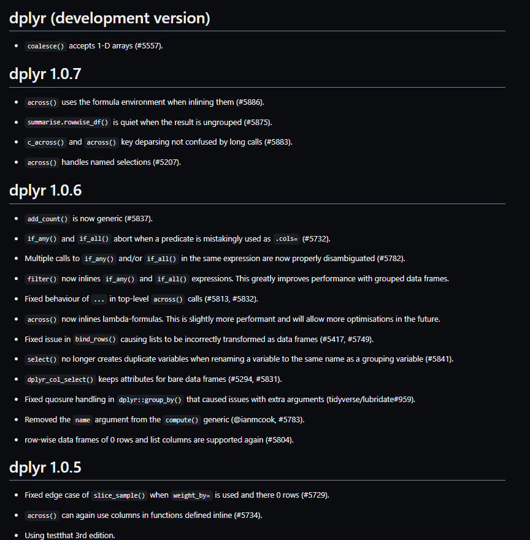
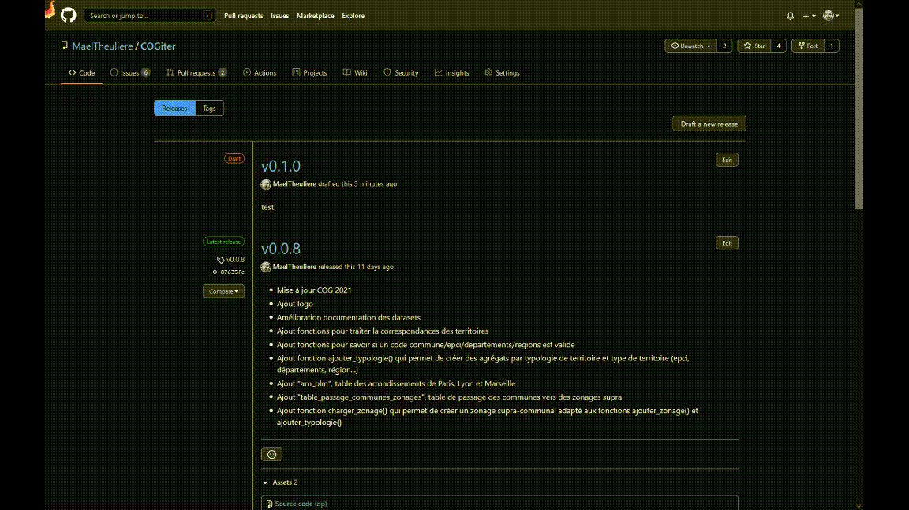
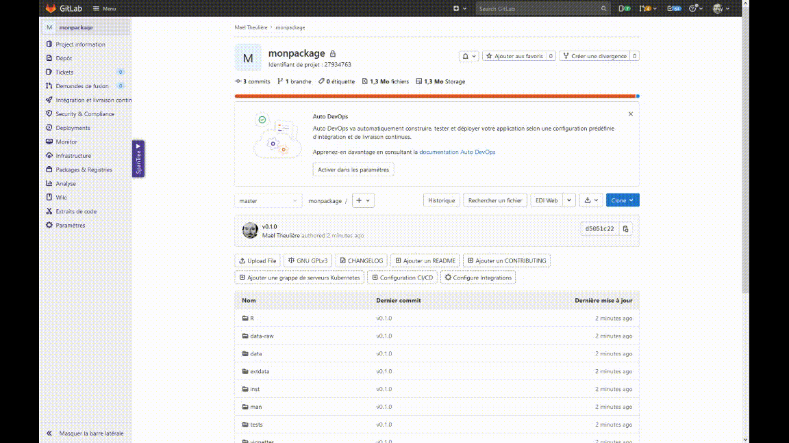

```{r setup, include=FALSE}
options(htmltools.dir.version = FALSE)
knitr::opts_chunk$set(echo = TRUE, eval=FALSE, warning=FALSE, message = FALSE)
```

```{r xaringan-themer, include=FALSE, warning=FALSE, eval=TRUE}
library(xaringanthemer)
style_mono_accent(
  base_color = "#000091",
  text_font_family = 'Marianne',
  code_font_family = 'Fira Code',
  background_color = 'white',
  title_slide_text_color = "#000091"
)
```


```{r xaringanpanelset, echo=FALSE, eval=TRUE}
xaringanExtra::use_panelset(in_xaringan = TRUE)
```

```{css echo=FALSE}
.panelset {
  --panel-tabs-sideways-max-width: 33%;
}
```

```{r share-again, echo=FALSE, eval=TRUE}
xaringanExtra::use_share_again()
```

```{r xaringan-tile-view, echo=FALSE, eval=TRUE}
xaringanExtra::use_tile_view()
```

```{r xaringan-tachyons, echo=FALSE, eval=TRUE}
xaringanExtra::use_tachyons()
```

```{r meta, echo=FALSE, eval=TRUE}
library(metathis)
meta() %>%
  meta_general(
    description = "Gérer les versions de votre package",
    generator = "xaringan et remark.js"
  ) %>% 
  meta_name("github-repo" = "maeltheuliere/ateliers_rpackage") %>% 
  meta_social(
    title = "Gérer les versions de votre package",
    url = "https://maeltheuliere.github.io/ateliers_rpackage/atelier6.html",
    image = "https://maeltheuliere.github.io/ateliers_rpackage/slides/www/slide6.png",
    image_alt = "Diapo titre du diaporama gérer les versions de votre package",
    og_type = "website",
    og_author = "Juliette ENGELAERE-LEFEBVRE - Maël THEULIERE",
    twitter_card_type = "summary_large_image"
  )
```

```{r xaringanExtra-clipboard, echo=FALSE, eval=TRUE}
htmltools::tagList(
  xaringanExtra::use_clipboard(
    button_text = "<i class=\"fa fa-clipboard\"></i>",
    success_text = "<i class=\"fa fa-check\" style=\"color: #90BE6D\"></i>",
    error_text = "<i class=\"fa fa-times-circle\" style=\"color: #F94144\"></i>"
  ),
  rmarkdown::html_dependency_font_awesome()
)
```
class: center, middle

.fl.w-40.pa2[
```{r, include=TRUE,echo=FALSE, eval=TRUE, fig.width=3}
knitr::include_graphics("https://raw.githubusercontent.com/MaelTheuliere/ateliers_rpackage/main/slides/www/packagescompagnons.png")
```
]

.fl.w-60.pa2[

.f3[Créer son premier] .yellow.f3[package R]

.f1[Gérer ] .yellow.f1[les versions] .f1[de votre package]
]

.tr[
.f4[Juliette ENGELAERE-LEFEBVRE - Maël THEULIERE]
]
---
# Qu'est ce qu'une version ?

- Une *version* d'un logiciel correspond à un état donné de l'évolution d'un produit logiciel utilisant le *versionnage*

- Le versionnage est le mécanisme qui consiste à conserver la version d'une entité logicielle quelconque, de façon à pouvoir la retrouver facilement, même après l'apparition et la mise en place de versions plus récentes.

- Il est souvent associé à une numérotation spécifique de votre logiciel, parfois couplée à un nommage ad hoc en complément (R 4.0.3 "Bunny-Wunnies Freak Out", Ubuntu 21.04 "Hirsute Hippo")

.footnote[source : [wikipedia]( https://fr.wikipedia.org/wiki/Version_d%27un_logiciel)]

---
# Les différents types de version d'un logiciel 

Une version de développement est une version non stable du logiciel, car en cour de développement.

Une version patch de notre logiciel est une version corrective, elle ne doit ajouter que des corrections de bug ou éventuellement des fonctionnalités mineures.

Une version mineure peut contenir des corrections de bugs, des nouvelles fonctionnalités, et quelques changements ayant des impacts de rétrocompatibilité. 

Les versions majeures sont réservées : 
  - soit à l'annonce d'une version stabilisée de vos fonctionnalités (1.0.0) ;
  - soit à l'annonce, pour les suivantes, de ruptures majeures dans vos packages (souvent générant des problèmes de rétrocompatibilité importants).

---
# Pourquoi gérer les versions d'un package R ? 

Les packages R sont versionnés automatiquement. Quand vous créez un premier package, il a un numéro de version par défaut à 0.0.0.9000.

Versionner permet : 

- de faire évoluer votre package en augmentant/modifiant/supprimant des fonctionnalités ; 

- en documentant ces évolutions ;

- le tout sans rompre des chaînes de traitements de vos utilisateurs, qui pourront toujours utiliser une version donnée.
---
# Exemple : la vie de dplyr

```{r, eval = TRUE,echo = FALSE, fig.link = 'https://github.com/tidyverse/dplyr/blob/master/NEWS.md#dplyr-100', fig.height='60%',fig.asp=1}

```

---
class: inverse, center, middle

# Gérer vos versions : le workflow
---
# Tracer vos évolutions dans un fichier NEWS.md

Au début de vos développements, nous n'avez pas encore publié de version.  
Commencez déjà à tracer ce que vous ajoutez à votre package.

- Créer un fichier `NEWS.md` dans votre package pour détailler les évolutions au fur et à mesure de votre développement. Comme toujours,  {`usethis`} est là pour vous faciliter la vie : `usethis::use_news_md()`

- Tracez-y toutes les modifications des fonctionnalités : ajout de fonctions, modifications de fonctions, ajouts de tables.

- Regroupez les suivant une typologie qui vous paraît cohérente.

Exemple : 

- Nouvelles fonctionnalités
- Fonctionnalités expérimentales
- Améliorations mineures et corrections de bugs
- Evolutions susceptibles d'engendrer des modifications du code de vos utilisateurs (*breaking changes*)


---
# Accordez-vous sur système de codification de vos versions

La recommandation dans l'écosystème R est d'avoir une numérotation du type `majeur.mineur.patch.dev`. 
Par exemple : `v1.0.0.0` ou `v0.0.0.9000`.

Vous avez le droit de lui attribuer aussi des noms français ou anglais, souvent on se base sur thème précis. Par exemple, les femmes célèbres : "v1.0.0 Rosa Parks", "v1.1.0 Marie Curie", ...)

En général, le numéro associé à *dev* doit être très grand (exemple, 9000), afin de bien montrer qu'on est ici sur une version non stable de notre logiciel.  

---
# Publier une version de votre package

La montée de votre package vers une nouvelle version doit être indiquée à 3 endroits différents :

###  Dans le fichier DESCRIPTION

C'est ce qui est compris par R, c'est le numéro de version que vous retrouvez dans le panneau "packages" de l'interface Rstudio.

### Dans le fichier NEWS.md

C'est ce fichier qui sera compréhensible par vos utilisateurs, cela permet de les informer de la vie de votre package.

### Dans github ou gitlab

Ce qui permettra à utilisateur de pouvoir installer une version précise de votre package.
---
# Publier une version de votre package

Une fois encore, {`usethis`} à la rescousse `r  emo::ji("superhero")`

`usethis::use_version()` vous permet de compléter le fichier DESCRIPTION, le NEWS.md et de commiter cette modification immédiatement. Cette fonction prend en paramètre le saut de version que l'on veut faire (paramètre `which` qui peut prendre les valeurs "major", "minor", "patch", "dev").

.pull-left[
`usethis::use_github_release()` vous permet de créer un pré-publication de votre version active sur github. Il vous reste ensuite manuellement à la publier depuis l'interface de github.
]
.pull-right[
```{r, echo=FALSE,eval=TRUE}

```
]
---
# Publier une version de votre package
.pull-left[
Sur gitlab, l'opération de publication de la version est à réaliser manuellement depuis l'interface.
]
.pull-right[
```{r, echo=FALSE,eval=TRUE}

```
]

